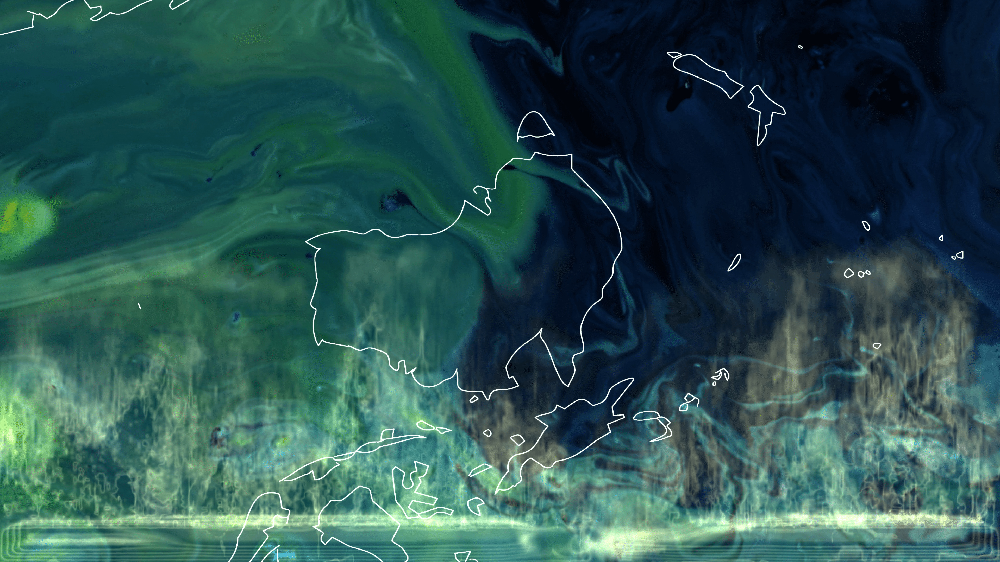
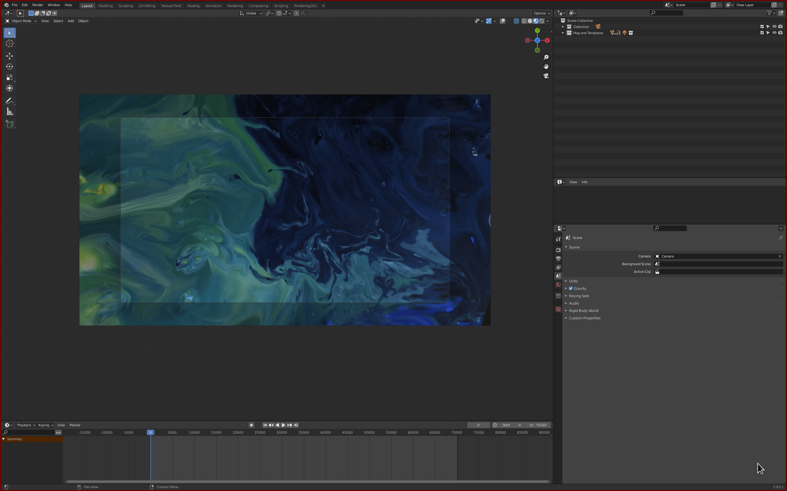
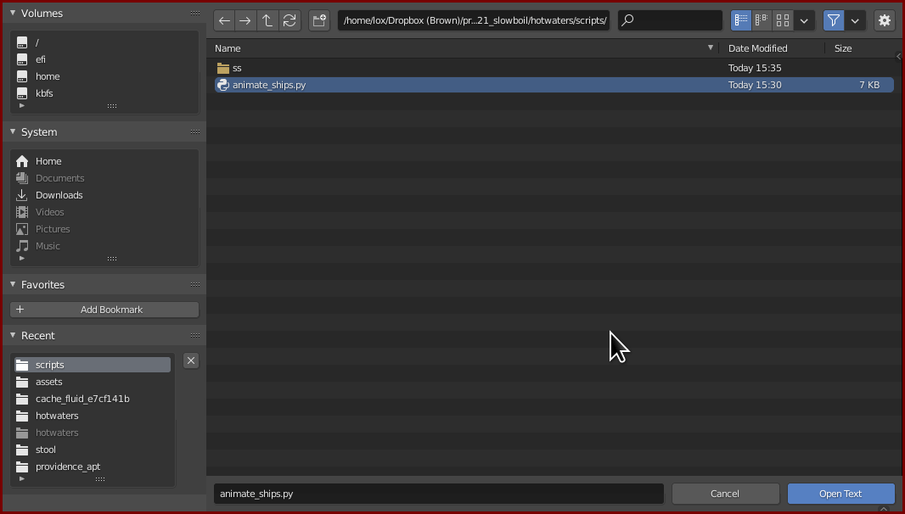

# Hot Waters

_Hot Waters_ is a synchronised video installation that was exhibited in the [Slowboil Exhibition](https://www.slowboil.online/about) at [Artspace Aotearoa](https://artspace-aotearoa.nz/) in 2021. It consists of two 50 minute films, synchronised across two screens using [frame](https://github.com/forensic-architecture/frame), an open source scheduling software for video playback in exhibitions.



The video projected onto the oval (2.4m x 1.2m and tilted at 12deg) is rendered from the Blender project in this repository.

## Getting the data
The original data representing when ships carrying phosphate from Western Sahara to New Zealand ports is available in [this Google Sheet](https://docs.google.com/spreadsheets/d/1WlphTdwnsCJfLnSXbrexUKRQ2JOt_kG9Huy1WXThKzU/edit#gid=0). (A transformed version of this also exists JSON files in the 'assets' folder that can be downloaded in [Blender setup](#blender-setup)).

## Getting the output files
If you're just interested in the final two video renders and other files (such as the accompanying infopanel and the YAML files to synchronise the two screens in frame), you can retrieve those by downloading the 'OUT' folder. Inside a Bash shell:

```bash
bash download_OUT.sh
```

## Blender setup

1. Download all of the assets. Note that these are ~15Gb, and so this step may take a while and require a good Internet connection. Inside a Bash shell:

```bash
bash download_assets.sh
```

2. Open up the scene in 'infographic.blend' in Blender 2.92. Initially you should see just the background texture on a plane:




In order to populate the scene with the various instantiations of the map texture and phosphate, you'll need to run the [animate_ships.py](./scripts/animate_ships.py) script in Blender. Using template objects that already exist inside the scene, this script will time their animations according to the ships data.

Select the 'Scripting' tab in the topbar, and open up the 'animate_ships.py' script:



Then simply run the script, wait a few seconds, and jump back into the regular layout. You should now have the full animation.

To refresh the Blender scene, simply delete everything in the Outliner that is _NOT_ in the 'Map and Templates' folder.
